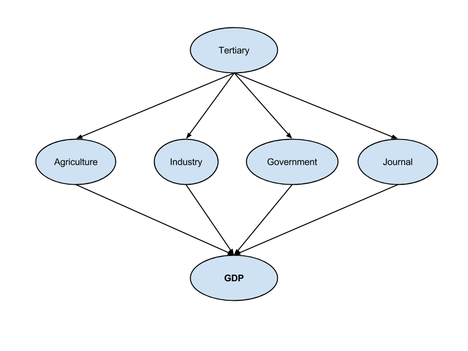
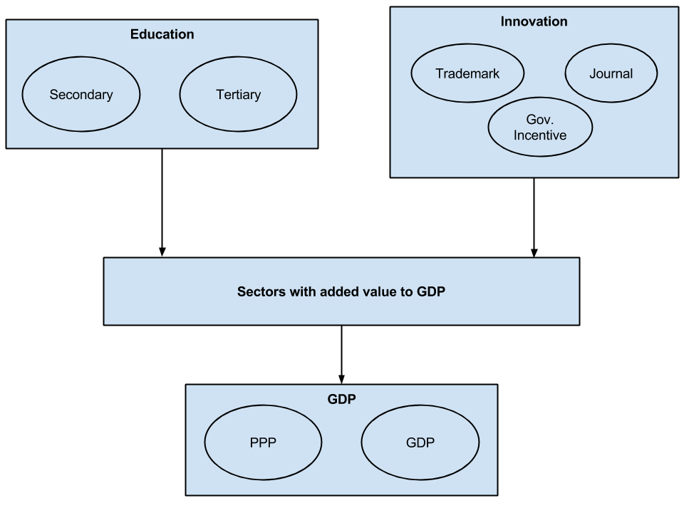
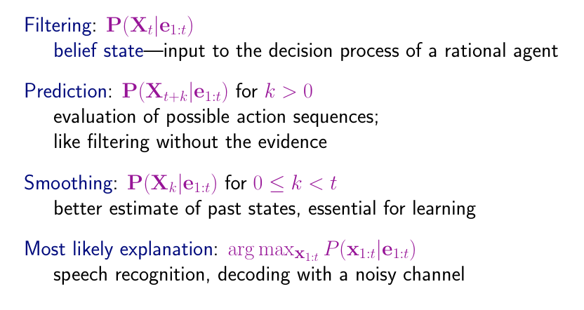

# An STE-based methodology for constructing Bayesian Belief Networks as applied to the prediction of Economic Indicators
- - -

## Selected regions
1. East Asia & Pacific
2. Europe & Central Africa
3. Latin America & Caribbean
4. Middle East & North Africa
5. South Asia
6. Sub-saharan Africa
7. North America
8. World

## Time range
The dataset is ranging from 1975 to 2013

## Variables
1. Journal     > _Scientific and technical journal articles_
2. Trademark   > _Trademark applications total_
3. Agriculture > _Agriculture, value added (% of GDP)_
4. Industry    > _Industry, value added (% of GDP)_
5. Manufacture > _Manufacturing, value added (% of GDP)_
6. Service     > _Services, etc., value added (% of GDP)_
7. Government  > _General government final consumption expenditure (% of GDP)_
8. **GDP**     > _GDP growth (annual %) GDP per capita_
9. **PPP**         > _GDP per capita, PPP (constant 2011 international $)_
10. Secondary      > _Labor force with secondary education (% of total)_
11. Tertiary      > _Labor force with tertiary education (% of total)_

[Variable definitions](variables.md)

## Sample dataset
| Journal (%) | Trademark (%) | Agriculture (%) | Industry (%) | Manufacture (%) | ... |
|-------------|---------------|-----------------|--------------|----------------|-----|
| 0.002       | 0.0001        | 16.345          | 39.350       | 11.048         | ... |
| 0.012       | 0.0010        | 17.271          | 39.599       | 11.722         | ... |

## Queries
1. Will the GDP increase?

  > P(GDP | Indicators)

2. Which factor contribute the most to the GDP?

  > MAX { P(Agriculture | GDP, Edu), P(Industry | GDP, Edu), P(Service | GDP, Edu) }

3. How likely that the GDP will grow with the increasing college graduates?

  > P(GDP | Tertiary)

4. Which between Secondary and College education is important to the GDP?

  > MAX { P(Secondary | GDP, Indicators), P(Tertiary | GDP, Indicators) }

## Bayesian network 1

[Dependencies for each region](dependenciesBN1.md)

## Bayesian network 2

[Dependencies for each region (layers 1-3)](dependenciesBN2.md)
[Dependencies for each region (layer 1)](dependenciesBN2a.md)

## Inference tasks from the slide

## References
[References](references.md)
